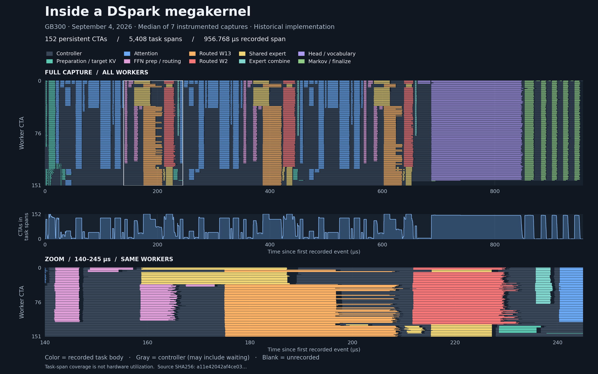

# Megakernels vs CUDA Graphs

**Two case studies where CUDA Graphs + programmatic dependent launch (PDL)
perform roughly on par with megakernels:** Llama decode and DSpark proposals.
The measured gaps are 0.7–4.6%, with different numerical behavior.

Megakernel research needs more implementations and baselines that others can
run, inspect and extend. We’re collecting both approaches to support that work.

| Case | GPU | CUDA Graphs + PDL | Megakernel | Difference |
|---|---|---:|---:|---|
| [Llama 1B](llama/docs/RESULTS.md) | H100 | 979.51 µs | 972.78 µs | Megakernel throughput +0.69% |
| [Llama 1B](llama/docs/RESULTS.md) | H200 | 794.74 µs | 759.83 µs | Megakernel throughput +4.59% |
| [DSpark](dspark/README.md) | GB300 | 803.968 µs | 828.544 µs | Megakernel latency +3.06% |

Llama: mean per decode step, original unmodified HazyResearch kernel.
DSpark: p50 per proposal, one fixed input/session. These are timing comparisons:
Llama’s conventional baseline passes the numerical criteria; Hazy misses them.
DSpark has unresolved logit/confidence differences. Neither establishes a general
advantage or end-to-end serving result.

## Inside a megakernel

One row per GPU worker, inspired by HazyResearch's
[bubble diagrams](https://hazyresearch.stanford.edu/blog/2025-05-27-no-bubbles).
Colors show task bodies; gray shows controller spans that may include waiting.
Blank regions are unrecorded, not proven idle. The zoom shows the first FFN.
This is the **median of seven historical instrumented GB300 captures
(September 4, 956.768 µs)**, separate from the final p50 results above.
[Trace provenance and rendering command](dspark/docs/bubbles.md).

## Layout

| Directory | Contents |
|---|---|
| [`llama/`](llama/README.md) | H100/H200 kernels, benchmark, references and one-GPU runner |
| [`dspark/`](dspark/README.md) | GB300 proposal kernel, graph baseline and replay tools; external artifacts required |

Each directory has its own environment and tests. Follow its README and run
commands from that study’s folder.

Improve either Llama baseline by editing [`llama/kernels/`](llama/kernels/) or
[`llama/megakernel/`](llama/megakernel/), then submit a PR. See the
[competitor guide](llama/AGENTS.md).

The Llama baseline uses fused projections, packed weights, split FP32 reductions
and Triton attention: 100 kernels per decode step. Graphs reduce host submissions;
PDL overlaps independent weight loading with preceding work. Start with
[llama/kernels/candidate.py](llama/kernels/candidate.py) and [projection.cu](llama/kernels/projection.cu).

## Sources

The Llama megakernel vendors [HazyResearch Megakernels](https://github.com/HazyResearch/Megakernels)
CUDA sources; see [origin and license](llama/megakernel/ORIGIN.md).
The runner fetches the pinned Hazy Python runtime and
[ThunderKittens](https://github.com/HazyResearch/ThunderKittens).
[Measured source hashes](llama/tools/source_inventory.py).
DSpark derives from [DeepSpec](https://github.com/deepseek-ai/DeepSpec) and retains
its [license](dspark/LICENSE) and [notices](dspark/NOTICE),
which apply to that subtree. Model weights are obtained separately.
